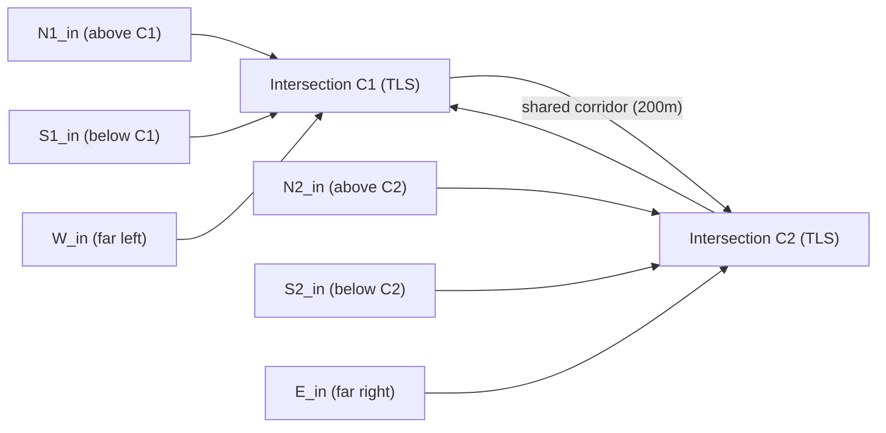

# Multi-Intersection SUMO Network for Multi-Agent AI Traffic Control

## Problem
Current setup: single 4-phase intersection (node C). Goal: two interconnected intersections with one AI agent per intersection to demonstrate **multi-agent collaboration** for network-level congestion reduction.

## Network Design



**Two 4-way intersections (C1, C2) connected by an East-West corridor:**
- **C1** at position (0, 0) — has North, South, West external approaches + East link to C2
- **C2** at position (300, 0) — has North, South, East external approaches + West link from C1
- **Corridor**: Bi-directional 2-lane road between C1 ↔ C2 (300m, ~22s travel time)
- All external approaches: 200m, 2 lanes, 13.9 m/s (50 km/h) — matching existing setup

> [!IMPORTANT]
> **Why this topology?** Traffic leaving C1 eastbound arrives at C2 (and vice versa). If the two agents don't coordinate, a green wave at C1 floods C2, causing queues. This creates a clear scenario where multi-agent collaboration outperforms isolated control.

## Folder Structure

Files go under a new `multi_intersection/` folder, mirroring the existing `simulation/` structure:

```
d:\MS Thesis Imp\basic\
├── simulation/            # (existing single intersection - untouched)
├── multi_intersection/    # NEW
│   ├── network/
│   │   ├── nodes.nod.xml
│   │   ├── edges.edg.xml
│   │   ├── connections.con.xml
│   │   ├── corridor.net.xml      (generated by netconvert)
│   │   ├── corridor_tls.add.xml  (4-phase TLS for both C1 and C2)
│   │   └── detectors.add.xml
│   ├── routes/
│   │   └── random.rou.xml        (generated by randomTrips.py)
│   ├── cfg/
│   │   └── corridor.sumocfg
│   ├── outputs/
│   │   └── raw/                  (empty folder for SUMO outputs)
│   └── scripts/
│       ├── compute_metrics_offline.py (adapted for corridor)
│       └── realtime/
│           └── realtime_publisher.py  (publishes both TLS)
└── AI layer/
    ├── agentic_brain.py              (existing single agent - untouched)
    ├── traffic_agent.py              (existing single agent - untouched)
    ├── multi_agentic_brain.py        (NEW: two LLM agents, one per intersection)
    └── multi_traffic_agent.py        (NEW: two rule-based agents)
```

---

## Proposed Changes

### Network Files

#### [NEW] [nodes.nod.xml](file:///d:/MS%20Thesis%20Imp/basic/multi_intersection/network/nodes.nod.xml)
12 nodes total:
- `C1` (0,0) and `C2` (300,0) — both `type="traffic_light"`
- External boundary nodes for C1: `N1_in` (0,200), `N1_out` (0,120), `S1_in` (0,-200), `S1_out` (0,-120), `W_in` (-200,0), `W_out` (-120,0)
- External boundary nodes for C2: `N2_in` (300,200), `N2_out` (300,120), `S2_in` (300,-200), `S2_out` (300,-120), `E_in` (500,0), `E_out` (420,0)

#### [NEW] [edges.edg.xml](file:///d:/MS%20Thesis%20Imp/basic/multi_intersection/network/edges.edg.xml)
14 edges:
- C1 approaches: `N1_C1`, `C1_N1`, `S1_C1`, `C1_S1`, `W_C1`, `C1_W`
- C2 approaches: `N2_C2`, `C2_N2`, `S2_C2`, `C2_S2`, `E_C2`, `C2_E`
- Corridor: `C1_C2` (C1→C2), `C2_C1` (C2→C1) — all 2-lane, 13.9 m/s

#### [NEW] [connections.con.xml](file:///d:/MS%20Thesis%20Imp/basic/multi_intersection/network/connections.con.xml)
All turning movements at both intersections (through, left, right from each approach).

#### [NEW] [corridor_tls.add.xml](file:///d:/MS%20Thesis%20Imp/basic/multi_intersection/network/corridor_tls.add.xml)
Two separate 4-phase TLS programs (programID="1") — one for C1, one for C2. Each with the same structure as the existing `intersection_tls.add.xml`: 4 green phases (20s each) + 4 yellow phases (4s each).

#### [NEW] [detectors.add.xml](file:///d:/MS%20Thesis%20Imp/basic/multi_intersection/network/detectors.add.xml)
Induction loops on all incoming edges to both C1 and C2 (including corridor edges).

---

### Configuration

#### [NEW] [corridor.sumocfg](file:///d:/MS%20Thesis%20Imp/basic/multi_intersection/cfg/corridor.sumocfg)
References the net file, route file, and additional files. Same structure as existing `intersection.sumocfg` but pointing to corridor network files.

---

### Routes

#### [NEW] [random.rou.xml](file:///d:/MS%20Thesis%20Imp/basic/multi_intersection/routes/random.rou.xml)
Generated using SUMO's `randomTrips.py` on the new network. ~1800 trips over 3600s (same density as existing setup).

---

### Scripts

#### [NEW] [realtime_publisher.py](file:///d:/MS%20Thesis%20Imp/basic/multi_intersection/scripts/realtime/realtime_publisher.py)
Based on existing publisher, but:
- Publishes TLS state for **both** C1 and C2
- Vehicle lane data includes corridor edges (C1_C2, C2_C1)
- Sets both C1 and C2 to program "1"

#### [NEW] [compute_metrics_offline.py](file:///d:/MS%20Thesis%20Imp/basic/multi_intersection/scripts/compute_metrics_offline.py)
Adapted version for the corridor network's output directory.

---

### AI Layer

#### [NEW] [multi_agentic_brain.py](file:///d:/MS%20Thesis%20Imp/basic/AI%20layer/multi_agentic_brain.py)
Two LLM-based agents:
- **Agent C1**: Monitors queues at C1 (N1, S1, West, corridor-from-C2). Its prompt includes C2's current phase so it can anticipate incoming traffic waves.
- **Agent C2**: Monitors queues at C2 (N2, S2, East, corridor-from-C1). Gets C1 state.
- **Collaboration**: Each agent's prompt includes the other's current phase + corridor queue, enabling coordination.

#### [NEW] [multi_traffic_agent.py](file:///d:/MS%20Thesis%20Imp/basic/AI%20layer/multi_traffic_agent.py)
Two rule-based agents (one per intersection) for baseline comparison, without inter-agent information sharing.

---

## Build Steps (netconvert)

```bash
# 1. Generate the network file
cd "d:\MS Thesis Imp\basic\multi_intersection\network"
netconvert --node-files=nodes.nod.xml --edge-files=edges.edg.xml --connection-files=connections.con.xml -o corridor.net.xml

# 2. Generate random routes
cd "d:\MS Thesis Imp\basic\multi_intersection"
python "%SUMO_HOME%\tools\randomTrips.py" -n network/corridor.net.xml -r routes/random.rou.xml --seed 123 -p 2.0 -b 1 -e 3600
```

## Verification Plan

### Automated Tests  
1. Run `netconvert` — must produce `corridor.net.xml` without errors
2. Open in `sumo-gui` — visually confirm two intersections connected by corridor
3. Run `realtime_publisher.py` — confirm MQTT publishes data for both C1 and C2

### Comparison Tests
1. Run simulation with `multi_traffic_agent.py` (rule-based, no coordination)
2. Run simulation with `multi_agentic_brain.py` (LLM-based, agents share info)
3. Compare metrics using `compute_metrics_offline.py`
4. Expected: AI agents with shared context should reduce delays on the corridor
