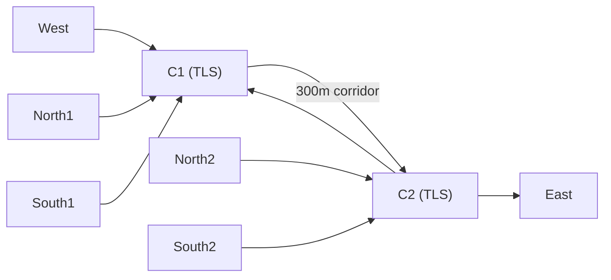

# Multi-Intersection Network — Walkthrough

## What Was Built

A dual-intersection SUMO corridor (C1 ↔ C2) with two AI agents controlling traffic signals.



## Files Created

### Network (`multi_intersection/network/`)
| File | Purpose |
|------|---------|
| [nodes.nod.xml](file:///d:/MS%20Thesis%20Imp/basic/multi_intersection/network/nodes.nod.xml) | 14 nodes: C1, C2 + external approaches |
| [edges.edg.xml](file:///d:/MS%20Thesis%20Imp/basic/multi_intersection/network/edges.edg.xml) | 14 edges: approaches + corridor |
| [connections.con.xml](file:///d:/MS%20Thesis%20Imp/basic/multi_intersection/network/connections.con.xml) | 24 turning movements |
| [corridor_tls.add.xml](file:///d:/MS%20Thesis%20Imp/basic/multi_intersection/network/corridor_tls.add.xml) | 4-phase TLS for C1 and C2 |
| [detectors.add.xml](file:///d:/MS%20Thesis%20Imp/basic/multi_intersection/network/detectors.add.xml) | 16 induction loops across both intersections |
| [corridor.net.xml](file:///d:/MS%20Thesis%20Imp/basic/multi_intersection/network/corridor.net.xml) | Generated by netconvert |

### Config & Routes
| File | Purpose |
|------|---------|
| [corridor.sumocfg](file:///d:/MS%20Thesis%20Imp/basic/multi_intersection/cfg/corridor.sumocfg) | SUMO simulation config |
| [random.rou.xml](file:///d:/MS%20Thesis%20Imp/basic/multi_intersection/routes/random.rou.xml) | ~1800 trips over 3600s |

### Scripts (`multi_intersection/scripts/`)
| File | Purpose |
|------|---------|
| [realtime_publisher.py](file:///d:/MS%20Thesis%20Imp/basic/multi_intersection/scripts/realtime/realtime_publisher.py) | Publishes C1+C2 data via MQTT |
| [compute_metrics_offline.py](file:///d:/MS%20Thesis%20Imp/basic/multi_intersection/scripts/compute_metrics_offline.py) | Offline metrics per intersection |

### AI Layer
| File | Purpose |
|------|---------|
| [multi_traffic_agent.py](file:///d:/MS%20Thesis%20Imp/basic/AI%20layer/multi_traffic_agent.py) | Rule-based baseline (no collaboration) |
| [multi_agentic_brain.py](file:///d:/MS%20Thesis%20Imp/basic/AI%20layer/multi_agentic_brain.py) | LLM agents with shared corridor context |

## How to Run

**Terminal 1 — Start simulation:**
```bash
cd "d:\MS Thesis Imp\basic\multi_intersection\scripts\realtime"
python realtime_publisher.py
```

**Terminal 2 — Start AI controller (pick one):**
```bash
cd "d:\MS Thesis Imp\basic\AI layer"

# Option A: Rule-based baseline (no collaboration)
python multi_traffic_agent.py

# Option B: LLM-based with collaboration (requires OPENAI_API_KEY)
python multi_agentic_brain.py
```

**After simulation — Compute metrics:**
```bash
cd "d:\MS Thesis Imp\basic\multi_intersection\scripts"
python compute_metrics_offline.py
```

## Verification Results

SUMO dry-run (100 steps) completed successfully:

```
Vehicles: Inserted 49 | Completed 10 | Running 39
Avg Route Length: 402.56m (confirms cross-intersection travel)
Avg Speed: 9.59 m/s | Avg WaitingTime: 6.10s
```

> [!NOTE]
> The TLS state strings were validated against netconvert's generated link count (16 links per intersection). Existing single-intersection files in `simulation/` remain untouched.
